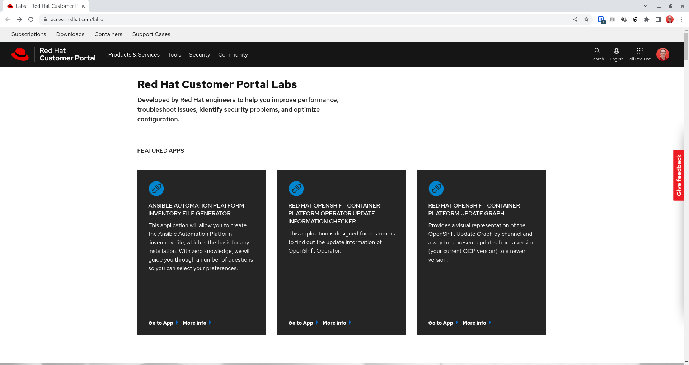
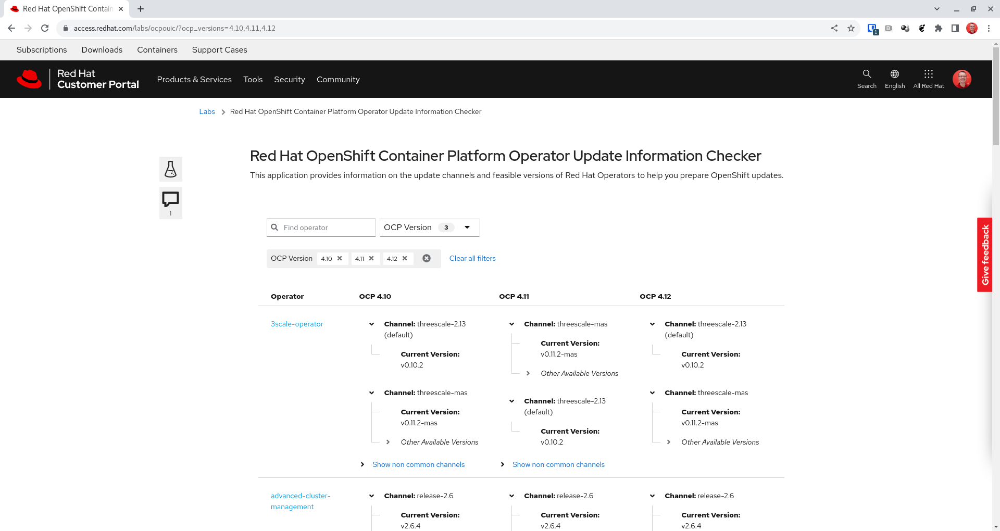
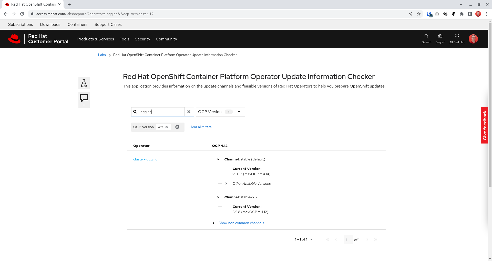
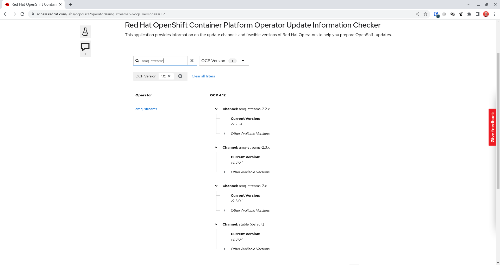
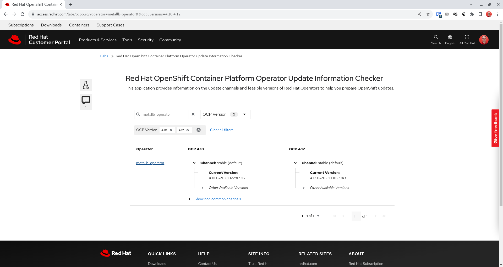

The Operator Update Information Checker

*By Robert Baumgartner, Red Hat Austria, March 2023*

# Summary

Recently, Red Hat has released a tool at the Customer Portal Labs which can give very detailed information about OpenShift Operators and available updates, supported versions, and much more.

The name of that tool is **Red Hat OpenShift Container Platform Operator Update Information Checker**.

You can find it at the 
[Customer Portal Labs](https://access.redhat.com/labs/).



## Overview

When you start the **Operator Update Information Checker** you will get a long list of currently available operators. 
At the time of writing I found 108 (!) pages.

Supported OpenShift versions 4.6+



Now you can start to tweak the output.

## Tweak / Filter the output

You can start by selecting a specific OpenShift version. Or maybe two, when you are interested which operator is available in your current version and the version you are upgrading to.

You can also start typing an operator name to get only a specific operator you are currently interested in.



In the above example screen you see the two channels `stable` and `stable-5.5` of the logging operator in OpenShift version 4.12.

- For the `stable` channel the current operator version is 4.6.3. And this version will be supported until OpenShift version 4.14. (MaxOCP)
- For the `stable-5.5` channel the current operator version is 5.5.8. And this operator will not be supported in OpenShift after 4.12 as of now.

## Many channels

When you select amq-streams (Kafka) you will find that many channels are available.



- The `stable` channel points to version v2.3.0-1, the latest version.
- The `amq-streams-2.2.x` channel points to version v2.2.1-0.
- The `amq-streams-2.x` channel points to v2.3.0.1.

None of these operator channels has defined a latest version. This does not mean it will be supported forever. You have to look at the release information!

## Version change with OpenShift version



If you select the MetalLB operator you will see an example of an operator that has just one channel. And when you upgrade from OpenShift version 4.10 to 4.12, the operator will be automatically upgraded to a newer version (4.12.0-202303021943).

## API Interface

- Is there an API available/planned? json/yaml output
- How to call?
- Would be nice, to get only the operators I am running on my cluster
- How to select a list of operators?

```shell
$ oc get subscriptions.operators.coreos.com -A -o custom-columns='NAME:.metadata.name,CHANNEL:.spec.channel' --no-headers |sort
amq-streams                                                         stable
costmanagement-metrics-operator                                     stable
devworkspace-operator-fast-redhat-operators-openshift-marketplace   fast
jaeger-product                                                      stable
netobserv-operator                                                  v0.2.x
openshift-cert-manager-operator                                     tech-preview
openshift-gitops-operator                                           latest
openshift-pipelines-operator-rh                                     latest
opentelemetry-product                                               stable
red-hat-camel-k                                                     latest
rhsso-operator-stable-redhat-operators-openshift-marketplace        stable
serverless-operator                                                 stable
web-terminal                                                        fast
```
